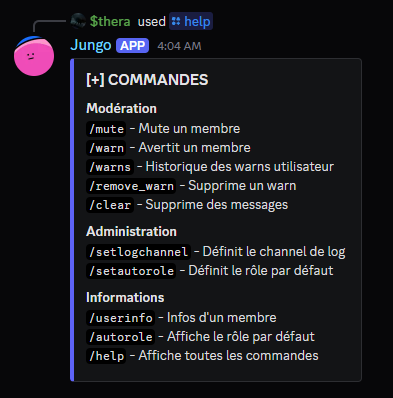

# Jungo — Bot de modération Discord
Jungo est un bot Discord de modération et de sécurité, conçu pour la gestion administrative d'un serveur. Il permet d'automatiser les sanctions, de tracer les actions des modérateurs et de centraliser les logs dans un channel dédié.
> Projet réalisé dans le cadre du BTS SIO option SISR.


## Architecture du projet
```
Jungo/
├── cogs/                   # Commandes et événements Discord
│   ├── admin.py            # Commandes d'administration (setlogchannel, reload cogs...)
│   ├── moderation.py       # Commandes de modération (mute, warn, clear...)
│   ├── events.py           # Événements automatiques (arrivée, départ...)
│   ├── errorHandler.py     # Gestion centralisée des erreurs
│   └── user.py             # Commandes utilisateurs (userinfo...)
├── utils/                  # Fonctions annexes
│   ├── colorsEmbed.py      # Couleurs embed
│   ├── database.py         # Requêtes SQLite (warns, config...)
│   └── logFormatter.py     # Formatage coloré des logs terminal
├── .ENV                    # Variables d'environnement
├── bdd.db                  # Base de données SQLite
├── requirements.txt        # Dépendances Python
└── start.py                # Config du bot + start
```


## Fonctionnalités
### Modération
| Commande | Description | Permission requise |
|---|---|---|
| `/mute` | Mute un membre pour une durée définie (1d, 2h, 30m...) | Mute des membres |
| `/warn` | Avertit un membre avec une raison. Sanctions automatiques à 3 et 5 warns | Mute des membres |
| `/warns` | Affiche l'historique des warns d'un membre | Mute des membres |
| `/remove_warn` | Supprime un warn par son ID | Mute des membres |
| `/clear` | Supprime entre 5 et 100 messages dans un channel | Gérer les salons |

### Administration
| Commande | Description | Permission requise |
|---|---|---|
| `/setlogchannel` | Définit le channel de logs du serveur | Administrateur |
| `/userinfo` | Affiche les informations d'un membre (rôles, dates, warns) | Tous |

### Événements automatiques
| Événement | Action |
|---|---|
| Arrivée d'un membre | Embed de bienvenue dans le channel de logs |
| Départ d'un membre | Embed de départ dans le channel de logs |

### Sanctions automatiques
Les warns déclenchent automatiquement des sanctions progressives :
- **3 warns** → Mute automatique de 2h
- **5 warns** → Ban automatique du serveur




## Installation
### Prérequis
- Python 3.14+
- Un bot Discord créé sur le [Portail Développeur Discord](https://discord.com/developers/applications)
- Les intentions `SERVER MEMBERS` et `MESSAGE CONTENT` activées sur le portail
- Inviter le bot sur votre serveur : [LIEN](https://discord.com/oauth2/authorize?client_id=1478786956446928977&permissions=1099511635968&integration_type=0&scope=bot)

### Étapes
**1. Cloner le projet**
```bash
git clone https://github.com/loski554/jungo.git
cd jungo
```

**2. Installer les dépendances**
```bash
pip install -r requirements.txt
```

**3. Configurer les variables d'environnement**
Créer un fichier `.ENV` à la racine du projet :
```
TOKEN=ton_token_discord_ici
```

**4. Lancer le bot**
```bash
python start.py
```


## 📌 Configuration du bot sur le serveur
Une fois le bot lancé et invité sur le serveur, configurer le channel de logs :
```
/setlogchannel #nom-du-channel
```
Toutes les actions de modération seront automatiquement tracées dans ce channel.


## Choix techniques
**SQLite** — Base de données légère, sans serveur, adaptée à un déploiement local. Stocke la configuration par serveur et l'historique complet des warns.

**Architecture en cogs** — Chaque fonctionnalité est isolée dans un fichier séparé. Permet de recharger un module sans redémarrer le bot (`/reload`), et facilite la maintenance.

**Séparation `utils/` et `cogs/`** — Les fonctions d'accès à la BDD sont centralisées dans `utils/database.py` et réutilisées par tous les cogs.

**Traçabilité des actions** — Chaque action de modération génère un embed dans le channel de logs Discord.

**Sécurité des commandes** — Les commandes de modération vérifient la hiérarchie des rôles avant d'agir : un modérateur ne peut pas sanctionner un membre avec un rôle supérieur ou égal au sien.


## Dépendances
```
discord.py
aiosqlite
humanfriendly
```

## ✍️ Auteur
Projet réalisé par **Lucas Goulain/loski554**